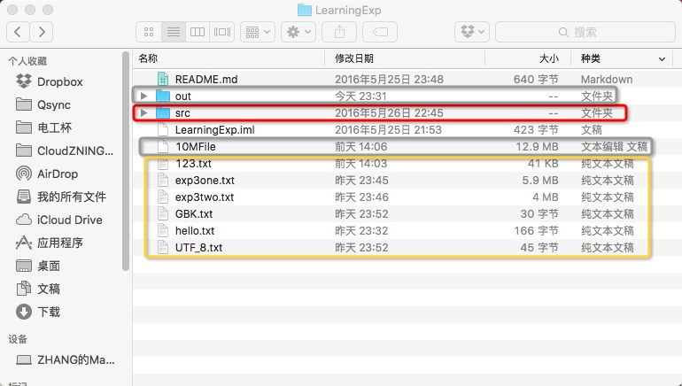

##准备工作
1. 确保将源码、电子版报告按照下述文件格式放好，并重新命名为“学号 姓名”的格式：

		————201301050400 张三（文件夹）
	
	   	  +————201301050400 张三 实验报告.pdf
	   	
	   	  +————201301050400 张三 源码（文件夹）
   
2. 确保电子版报告以PDF格式保存好。为保证阅读可视性，建议各位将电子版报告另存为PDF。这只是建议不是强制，需要得高分的推荐这样做。现在Microsoft Office 2010及以上版本，WPS2015及以上版本都可以直接另存为PDF格式。具体教程不再赘述，请自行搜索。
3. 确保上述步骤完成后，将顶层文件夹（即上述实例的“201301050400 张三”文件夹）打包成rar格式（不推荐使用zip，虽然可以上传）。
4. 到提交页面填写信息，选择文件，单击提交即可

##关于提交源码的相关说明

1. 源码提交时，只需要提交工程目录下的src文件夹中的源程序即可。即不要打破包结构，只需要提交src文件夹即可。
2. 实验三、四中使用的10M文件流读取实验的测试文件无需打包，其他输出文件选择性打包

	例如，下图中所示，红色框为需要提交的源码所在文件夹（src文件夹），灰色框为不需要提交的文件（10M文件流测试文件、编译时的class输出文件），黄色框为可以选择性提交的文件（程序输出的小型文件）。（图中未标出的是程序说明文档README.md和IntelliJ IDEA工程文件，可忽略）

	

3. 如果需要，可以添加README之类的说明文件以便老师查阅。

##关于其他问题

可联系我具体说明，我会在此文件后需补充